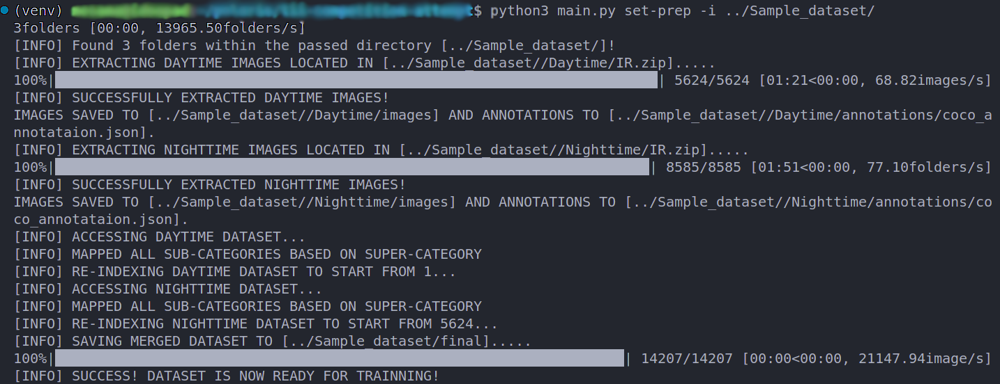

<a name="readme-top"></a>

<!-- PROJECT LOGO -->
<br />
<div align="center">
  <a href="https://github.com/mohd-osama-47/tii-competition-attempt">
    
  </a>

  <h3 align="center">Polaris</h3>
    <p align="center">
      Our attempt at the TII IR vision challenge!
      <br />
    </p>
</div>


<!-- TABLE OF CONTENTS -->
<details>
  <summary>Table of Contents</summary>
  <ol>
    <li>
      <a href="#about-the-project">About The Project</a>
    </li>
    <li>
      <a href="#getting-started">Getting Started</a>
    </li>
    <li><a href="#usage">Usage</a></li>
      <ul>
          <li><a href="#detection-mode">Detection Mode</a></li>
          <li><a href="#tracking-mode">Tracking Mode</a></li>
      </ul>
    <li>
      <a href="#generating-merged-dataset">Generating Merged Dataset</a>
      <ul>
        <li><a href="#dataset-prerequisites">Dataset Prerequisites</a></li>
        <li><a href="#merged-dataset-generation">Merged dataset generation</a></li>
      </ul>
    </li>
    <li><a href="#contact">Contact</a></li>
    <li><a href="#acknowledgments">Acknowledgments</a></li>
  </ol>
</details>


<!-- ABOUT THE PROJECT -->
## About The Project

Here is team Polaris' attempt at solving the infra-red vision challenge by TII! The following is a documentation of the codes and the approach taken to reach the solution at hand.

<div align="center">
  
</div>

<p align="right">(<a href="#readme-top">back to top</a>)</p>


<!-- GETTING STARTED -->
# Getting Started

Install the requirements by running the following after ```cd```ing into the repository's directory:
```sh
python3 -m pip install -r requirements.txt
```

The repository also contains tools and functionality that was used by the Polaris team to generate a combined dataset of both day and night annotated IR samples, as well as model prediction outputs of the trained model and the weights of said model.


<p align="right">(<a href="#readme-top">back to top</a>)</p>

<!-- USAGE EXAMPLES -->
## Usage

### Detection Mode
To detect instances in a directory of IR images using the trained model:
```python
python3 main.py predict -i {INPUT DIR OF IMAGES} -o {OUTPUT DIR} --save-images
```
The results will be saved in the passed directory in the form of images (if is set) and annotations in the form of a JSON file in an MSCOCO-like format.

Sample ```images``` and ```out``` directory are placed in the repository with 10 images. The results are saved as individual images matching the names of the input images.

The output directory will contain a json file that has the results of prediction of the 8 different classes according to the order of the images (based on alphabetical, natural sorting of the names of the folders to be exact). The json file is structured as follows:

<details>
<summary>Predict Mode JSON output</summary>

```json
{
    "info": {
        "contributor": "Polaris",
        "date_created": DATE,
        "description": "",
        "url": "",
        "version": "",
        "year": ""
    },
    "categories": [
        {
            "id": 1,
            "name": "Person",
            "supercategory": ""
        },
        {
            "id": 2,
            "name": "offroad_vehicle",
            "supercategory": ""
        },
        {
            "id": 3,
            "name": "Motorcyclist",
            "supercategory": ""
        },
        {
            "id": 4,
            "name": "ATV driver",
            "supercategory": ""
        },
        {
            "id": 5,
            "name": "None",
            "supercategory": ""
        },
        {
            "id": 6,
            "name": "Car",
            "supercategory": ""
        },
        {
            "id": 7,
            "name": "Bus",
            "supercategory": ""
        },
        {
            "id": 8,
            "name": "Truck",
            "supercategory": ""
        },
    ],
    "images": [
        {
            "id": ID,
            "width": 640,
            "height": 512,
            "file_name": FILE_NAME,
            "license": 0,
            "flickr_url": "",
            "coco_url": "",
            "date_captured": 0
        },
    ],
    "annotations": [
        {
          "id": ID,
          "image_id": IMAGE_ID,
          "category": ,
          "bbox": [
              Top Left X,
              Top Left Y,
              Width,
              Height
          ],
          "extra_dict": {
            "confidence": ,
          }
        }
    ],
}
```

</details>


### Tracking Mode
To track instances in a directory of IR images/video file using the trained model:
```python
python3 main.py track [-h] -i INPUT_PATH -o OUTPUT_PATH [--save-json] [--save-vid] [--show-vid] [--verbose] [--show-traj] [--is-video]
```
The results will be saved in the passed directory in the form of a JSON file (if set) as per the competition details. Optional flags are also available to save the output as a video file, showing the tracking output during execution, trajectory visualization, and verbose terminal output.

A sample ```night.avi``` video file is available under the ```resources``` directory that is made up of the night time scene supplied by TII in the rosbag file. The sample video was created by running the following ROS 1 command (from the ros-perception package):

```bash
rosrun image_view video_recorder image:=/flir_boson/image_rect
```

The classes output in the JSON file correspond to the following labels:
<details>
<summary>Track Mode JSON output</summary>


```json
"categories": [
  {
      "id": 0,
      "name": "Person",
  },
  {
      "id": 1,
      "name": "offroad_vehicle",
  },
  {
      "id": 2,
      "name": "Motorcyclist",
  },
  {
      "id": 3,
      "name": "ATV driver",
  },
  {
      "id": 4,
      "name": "None",
  },
  {
      "id": 5,
      "name": "Car",
  },
  {
      "id": 6,
      "name": "Bus",
  },
  {
      "id": 7,
      "name": "Truck",
  },
```

</details>

<p align="right">(<a href="#readme-top">back to top</a>)</p>

## Generating Merged Dataset
The following section explores **how** the dataset was combined and used to train a custom model based on the YOLOv8 architecture. This section is not necessary to run the code but is left here for documentation purposes.

### Dataset Prerequisites

**OPTIONAL: Generating the training dataset**

For generating the dataset used for training, a custom Python CLI is developed here that takes the original sample dataset provided by TII and does the work in place. The CLI expects the file structure to match what was passed by the TII team. This functionality is added here to show the approach the team has taken to generate a merged dataset containing all 14,207 annotated images of day and night IR samples.
The expected file structure of the sampled dataset (as supplied by the competition team) is as follows:

```
📦Sample_dataset
 ┣ 📂Daytime
 ┃ ┣ 📜IR.zip
 ┃ ┣ 📜RGB.zip
 ┃ ┣ 📜daytime.json
 ┃ ┣ 📜ir_timestamps.csv
 ┃ ┗ 📜rgb_timestamps.csv
 ┣ 📂Nighttime
 ┃ ┣ 📜IR.zip
 ┃ ┣ 📜ir_timestamps.csv
 ┃ ┗ 📜nighttime.json
 ┣ 📜README.pdf
 ┗ 📜sample_result_TII...ed-Tracking.json
```

### Merged dataset generation

To recreate the generation of the dataset, do the following:

The use of a virtual environment is **highly** recommended to account for the custom dataset's concents and labels:
```bash
python3 -m virtualenv venv
```
and then sourve the virtual environment:
```bash
. venv/bin/activate
```
```sh
python3 -m pip install -r requirements.txt
```
Once everything is installed, head to the python site packages within your virtual environment and edit the following file:

```{VIRTUAL ENVIRONMENT DIRECTORY}/lib/python{VERSION}/site-packages/datumaro/components/annotation.py```

by commenting line 165 :
```python
assert name not in self._indices, name #! << Comment this line please!
```

This is done to ensure that the original dataset works with the Datumaro dataset management framework without extensively changing the original json file of the annotations.

One more edit that is necessary for the dataset generation and merger to work out is to fill in a **missing super category present in the night dataset under id No. 11 (Person6) to be "person"** since it was missing in the original annotation file.

At the root of the project's directory, run the following to start the generation process:

```bash
python3 main.py set-prep -i {PATH TO DATASET DIRECTORY}
```
The CLI will now begin the dataset generation process and the progress will be shown visually. THe output should look akin to this:

<div align="center">
  
</div>

<p align="right">(<a href="#readme-top">back to top</a>)</p>


<!-- CONTACT -->
## Contact

Mohammed Osama - [LinkedIn](https://www.linkedin.com/in/mohd-osama) - mohd.osama.elnour@gmail.com

<p align="right">(<a href="#readme-top">back to top</a>)</p>


<!-- ACKNOWLEDGMENTS -->
## Acknowledgments
The following resources and packages have been used to aid in developing Team Polaris' approach to the problem:
* [Jocher, G., Chaurasia, A., & Qiu, J. (2023). YOLO by Ultralytics (Version 8.0.0) [Computer software].](https://github.com/ultralytics/ultralytics)
* [Broström, M. Real-time multi-object tracking and segmentation using Yolov8 with StrongSORT and OSNet (Version 9.0) (2023) [Computer software].](https://zenodo.org/record/7629840)
* [Mansour, M. (2020). Merge COCO Files [Computer software]. ](https://github.com/mohamadmansourX/Merge_COCO_FILES)

<p align="right">(<a href="#readme-top">back to top</a>)</p>
