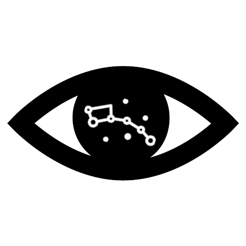

<a name="readme-top"></a>

<!-- PROJECT LOGO -->
<br />
<div align="center">
  <a href="https://github.com/mohd-osama-47/tii-competition-attempt">
    
  </a>

<h3 align="center">Polaris</h3>

  <p align="center">
    Our attempt at cracking the TII IR vision challenge!
    <br />
    <a href="https://github.com/github_username/repo_name"><strong>Explore the docs »</strong></a>
    <br />
    <br />
  </p>
</div>


<!-- TABLE OF CONTENTS -->
<details>
  <summary>Table of Contents</summary>
  <ol>
    <li>
      <a href="#about-the-project">About The Project</a>
    </li>
    <li>
      <a href="#getting-started">Getting Started</a>
      <ul>
        <li><a href="#dataset-prerequisites">Dataset Prerequisites</a></li>
      </ul>
    </li>
    <li><a href="#usage">Usage</a></li>
    <li><a href="#roadmap">Roadmap</a></li>
    <li><a href="#contact">Contact</a></li>
    <li><a href="#acknowledgments">Acknowledgments</a></li>
  </ol>
</details>


<!-- ABOUT THE PROJECT -->
## About The Project


Here is team Polaris' attempt at solving the infra-red vision challenge by TII! The following documentation of the codes and the approach taken to reach the solution at hand.

<p align="right">(<a href="#readme-top">back to top</a>)</p>

<!-- GETTING STARTED -->
## Getting Started
The repository contains tools and functionality that was used by the Polaris team to generate a combined dataset of both day and night annotated IR samples, as well as model prediction outputs of the trained model and the weights of said model. This functionality will be explored in this readme file.

### Dataset Prerequisites

**OPTIONAL: Generating the training dataset**

For generating the dataset used for training, a custom Python CLI is developed here that takes the original sample dataset provided by TII and does the work in place. The CLI expects the file structure to match what was passed by the TII team. This functionality is added here to show the approach the team has taken to generate a merged dataset containing all 14,207 annotated images of day and night IR samples.
The expected file structure of the sampled dataset (as supplied by the competition team) is as follows:

```
📦Sample_dataset
 ┣ 📂Daytime
 ┃ ┣ 📜IR.zip
 ┃ ┣ 📜RGB.zip
 ┃ ┣ 📜daytime.json
 ┃ ┣ 📜ir_timestamps.csv
 ┃ ┗ 📜rgb_timestamps.csv
 ┣ 📂Nighttime
 ┃ ┣ 📜IR.zip
 ┃ ┣ 📜ir_timestamps.csv
 ┃ ┗ 📜nighttime.json
 ┣ 📜README.pdf
 ┗ 📜sample_result_TII...ed-Tracking.json
```

#### Merged dataset generation
To recreate the generation of the dataset, do the following:

The use of a virtual environment is **highly** recommended to account for the custom dataset's concents and labels:
```bash
python3 -m virtualenv venv
```


Install the requirements by running the following:
```sh
python3 -m pip install -r requirements.txt
```
Once everything is installed, head to the python site packages within your virtual environment and edit the following file:

```{VIRTUAL ENVIRONMENT DIRECTORY}/lib/python{VERSION}/site-packages/datumaro/components/annotation.py```

by commenting line 165 :
```python
assert name not in self._indices, name #! << Comment this line please!
```

This is done to ensure that the original dataset works with the Datumaro dataset management framework without extensively changing the original json file of the annotations.

One more edit that is necessary for the dataset generation and merger to work out is to fill in a missing super category present in the night dataset under id No. 11 (Person6) to be "person" since it was missing in the original annotation file.

At the root of the project's directory, run the following to start the generation process:

```bash
python3 main.py set-prep -i {PATH TO DATASET DIRECTORY}
```
The CLI will now begin the dataset generation process and the progress will be shown visually. THe output should look akin to this:

<div align="center">
  
</div>

<!-- USAGE EXAMPLES -->
## Usage

To detect instances in a directory of IR images using the trained model:
```python
python3 main.py predict -i {INPUT DIRECTORY OF IMAGES} -o {OUTPUT DIRECTORY}
```
The results will be saved in the passed directory in the form of images and annotations superimposed over any detected objects.
Sample ```images``` and ```out``` directory are placed in the repository with 10 images. The results are saved as individual images matching the names of the input images.

**[FILL IN THE TRACKING STUFF + JSON PROCESSING]**


<p align="right">(<a href="#readme-top">back to top</a>)</p>


<!-- ROADMAP -->
## Roadmap

- [ ] Feature 1
- [ ] Feature 2
- [ ] Feature 3
    - [ ] Nested Feature


<p align="right">(<a href="#readme-top">back to top</a>)</p>


<!-- CONTACT -->
## Contact

Mohammed Osama - [LinkedIn](https://www.linkedin.com/in/mohd-osama) - mohd.osama.elnour@gmail.com

<p align="right">(<a href="#readme-top">back to top</a>)</p>


<!-- ACKNOWLEDGMENTS -->
## Acknowledgments
[ADD ALL LIBRARIES AND PAPERS WE HAVE USED AS INSPIRATION HERE!]
* []()
* []()
* []()

<p align="right">(<a href="#readme-top">back to top</a>)</p>
